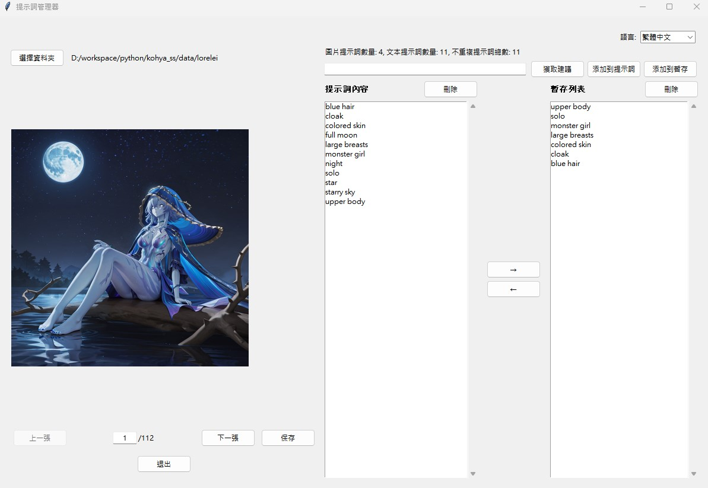
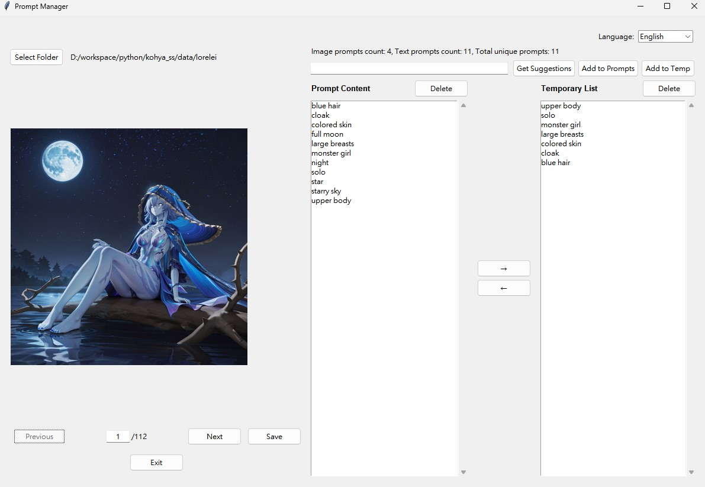

# Prompt Reader 提示詞管理器

[English](#english) | [繁體中文](#繁體中文)

## 繁體中文

### 簡介
Prompt Reader 是一個用於管理和編輯圖片提示詞的工具。它可以幫助用戶查看圖片、編輯相關的提示詞，並提供暫存功能以重複使用常用的提示詞。



### 環境需求
- Python 3.10 或更高版本
- tkinter
- Pillow 11.1.0（用於圖片處理）
- 作業系統：Windows、macOS 或 Linux

### 安裝說明
1. 克隆或下載此專案到本地
2. 安裝必要的 Python 套件：
   ```bash
   pip install -r requirements.txt
   ```


### 功能特點
- 圖片瀏覽功能
  - 支持瀏覽資料夾中的圖片
  - 可通過按鈕或輸入數字快速切換圖片
  - 顯示當前圖片索引和總數
- 提示詞管理
  - 自動讀取與圖片同名的 txt 文件中的提示詞
  - 支持直接輸入新的提示詞
  - 防止重複添加相同的提示詞
- 暫存列表功能
  - 可將常用提示詞保存到暫存列表
  - 支持在提示詞列表和暫存列表間複製提示詞
  - 自動保存暫存列表到 temp.txt 文件
- 多語言支持
  - 支持切換界面語言
  - 所有操作提示均支持多語言顯示
- 右鍵刪除功能
  - 支持右鍵直接刪除提示詞
- 雙擊移動提示詞
  - 支持雙擊移動提示詞
- 回車快速添加提示詞
  - 支持回車快速添加提示詞

### 使用說明
1. 啟動程式：運行 `prompt_reader.py`
2. 選擇資料夾：點擊「選擇資料夾」按鈕，選擇包含圖片和對應文本文件的資料夾
3. 瀏覽圖片：
   - 使用左側的圖片列表瀏覽圖片
   - 點擊圖片可在預覽區域查看大圖
   - 使用滑鼠滾輪或縮放按鈕調整圖片大小
4. 管理提示詞：
   - 左側列表顯示當前圖片的提示詞
   - 右側列表顯示暫存的提示詞
   - 使用輸入框添加新的提示詞
   - 使用箭頭按鈕或雙擊移動提示詞
   - 右鍵點擊直接刪除提示詞
5. 保存更改：點擊「保存」按鈕保存當前更改

### 檔案說明
- `prompt_reader.py`：主程式入口
- `requirements.txt`：Python 套件需求檔案
- `temp.txt`：暫存提示詞列表檔案
- `*.txt`：與圖片同名的提示詞檔案

---

## English

### Introduction
Prompt Reader is a tool for managing and editing image prompts. It helps users view images, edit associated prompts, and provides a temporary storage feature for frequently used prompts.



### Requirements
- Python 3.10 or higher
- tkinter 
- Pillow 11.1.0 (for image processing)
- Operating System: Windows, macOS, or Linux

### Installation
1. Clone or download this project to your local machine
2. Install required Python packages:
   ```bash
   pip install -r requirements.txt
   ```

### Features
- Image Browsing
  - Browse images in selected folder
  - Switch images via buttons or number input
  - Display current image index and total count
- Prompt Management
  - Automatically read prompts from txt files with same name as images
  - Support direct input of new prompts
  - Prevent duplicate prompt entries
- Temporary List
  - Save frequently used prompts to temporary list
  - Copy prompts between prompt list and temporary list
  - Auto-save temporary list to temp.txt file
- Multi-language Support
  - Switch interface language
  - Multi-language support for all operation prompts
- Right-click Delete
  - Right-click to delete selected prompt
- Double-click Move Prompt
  - Double-click to move prompt
- Enter Key Add Prompt
  - Enter key to add prompt to left list

### Usage Instructions
1. Start Program: Run `prompt_reader.py`
2. Select Folder: Click "Select Folder" button to choose a folder containing images
3. Browse Images:
   - Use left side image list to browse images
   - Click image to view large image in preview area
   - Use mouse wheel or zoom buttons to adjust image size
4. Manage Prompts:
   - Left list displays prompts for current image
   - Right list displays temporary prompts
   - Use input box to add new prompt
   - Use arrow buttons or double-click to move prompt
   - Right-click to delete prompt
5. Save Changes: Click "Save" button to save current changes

### File Description
- `prompt_reader.py`: Main program entry
- `requirements.txt`: Python package requirements file
- `temp.txt`: Temporary prompt list file
- `*.txt`: Prompt files with same names as images 

## Contribution

Welcome to submit issues and pull requests!

## License

MIT License 